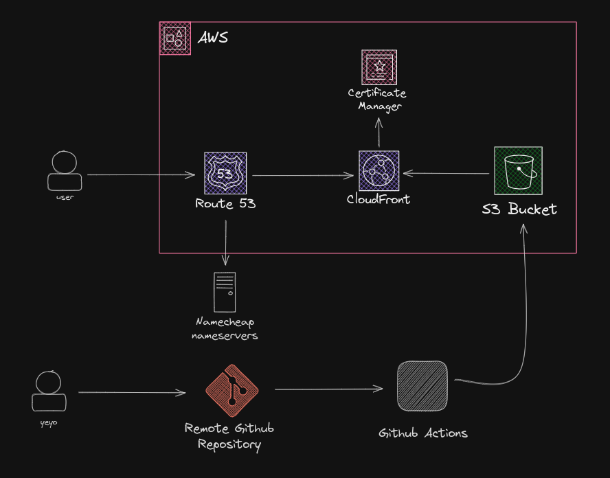

# YeyoM Portfolio

This is the repository for my personal portfolio, it is a simple website that showcases my projects and skills. This is the second version of my portfolio, the first one (which you can check [here](https://github.com/YeyoM/portfolio) was built with Next, Docker and Nginx and deployed to Digital Ocean, this version is built with Next.js and deployed to AWS S3.
You can visit the website [here](https://yeyom.tech).

## Technologies

- Next.js
- Docker
- Github actions
- AWS S3
- AWS Cloudfront
- AWS Route 53

## Architecture

The project is built with Next.js and Docker, the Dockerfile is used to build the project and the docker-compose file is used to run the project locally. The project is deployed to an S3 bucket and served through Cloudfront, the domain is managed by Route 53.



## How to run locally

To run the project locally you can run the following command:

```bash
npm run dev
```

## Test locally

To test the project (make sure the build is successful) you can run the following command:

```bash
./test.sh
```

## How to deploy

There is already a script and a CI and CD pipeline that uses github actions to deploy the project to the S3 bucket.
